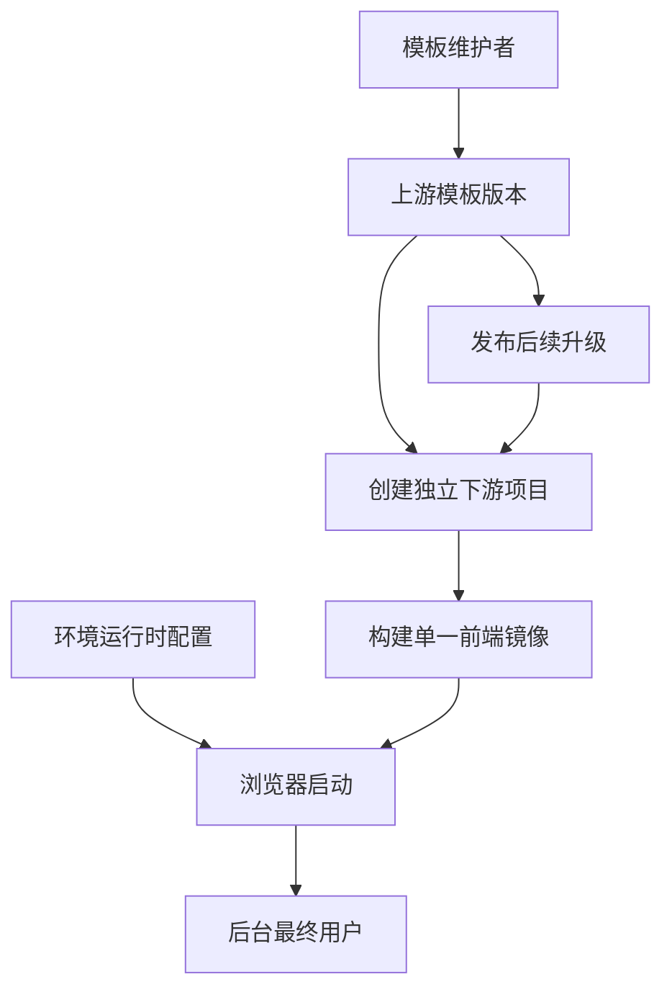

# React 中后台上游模板需求

## Summary

建立一个可长期维护的单仓库 React 中后台上游模板，提供通用后台能力、可定制的 QRouter 风格默认皮肤、双登录模式、运行时配置和 Caddy 容器部署。每个新项目保留独立仓库，同时可以按上游版本选择性接收模板升级。

---

## Problem Frame

当前 QRouter 是由多个静态 HTML、页面内样式和全局脚本组成的原型，实际开发需要重新补齐路由、状态、请求、认证、测试和部署等工程能力。现有 OPL Frontend 已验证了一套从静态原型迁移到 React 的做法，但其中混入了 OPL 专属布局、接口和聊天业务，不能直接作为所有新项目的公共起点。

如果每个新项目都复制并清理某个业务仓库，工程约定会逐渐分叉，认证、主题、国际化、运行时配置和部署问题也会被重复解决。若直接让下游长期追踪一个持续变化的业务仓库，又会产生大量无关合并冲突，难以判断哪些更新值得接收。

---

## Actors

- A1. 模板维护者：维护公共骨架、默认皮肤、升级说明和稳定版本。
- A2. 下游项目开发者：从模板创建独立项目，接入具体后端并实现业务模块。
- A3. 部署运维者：使用同一构建产物配置不同环境并部署容器。
- A4. 后台最终用户：登录项目，使用主题、语言及具体后台功能。

---

## Key Flows

- F1. 创建新项目
  - **Trigger:** A2 需要启动一个新的中后台项目。
  - **Actors:** A1, A2
  - **Steps:** 从稳定模板版本创建独立仓库；保留上游关联；填写项目公开配置；替换品牌和后端适配；在 Mock 模式下验证基础功能。
  - **Outcome:** 新项目可以独立开发和发布，同时保留后续接收上游升级的能力。
  - **Covered by:** R1, R2, R3, R4, R12, R13

- F2. 接收上游升级
  - **Trigger:** A1 发布新的稳定模板版本，A2 决定升级。
  - **Actors:** A1, A2
  - **Steps:** A2 查看版本说明和升级指引；选择目标版本；合并上游变更；只在明确的扩展边界内处理冲突；运行质量检查后完成升级。
  - **Outcome:** 下游获得所选公共能力更新，项目业务改动保持可控。
  - **Covered by:** R2, R3, R4, R18

- F3. 首次加载应用
  - **Trigger:** A4 第一次在某个部署环境打开应用，尚无本地主题和语言偏好。
  - **Actors:** A3, A4
  - **Steps:** 浏览器先读取并校验公开运行时配置；根据配置确定默认主题、语言、认证方式和公共连接信息；完成主题与语言初始化；校验成功后启动 React 应用。生产配置无效时停止启动并显示配置错误。
  - **Outcome:** 首屏直接使用部署环境指定的主题和语言，不出现可见的主题或语言跳变。
  - **Covered by:** R7, R8, R9, R10, R11

- F4. 认证与会话生命周期
  - **Trigger:** A4 进入需要认证的页面。
  - **Actors:** A4
  - **Steps:** 应用先恢复已有会话；未认证时根据运行时配置展示本地登录、OAuth2/OIDC 登录或两者；用户完成选定流程；前端把不同登录结果归一为统一会话和权限状态；退出、会话过期、未授权或 OIDC 回调失败时清理或恢复到可重试状态。
  - **Outcome:** 下游页面不需要区分具体登录来源即可读取当前用户和权限，会话异常也有统一退路。
  - **Covered by:** R12, R13, R14, R15, R16

- F5. 部署同一构建产物
  - **Trigger:** A3 将同一版本部署到开发、测试或生产环境。
  - **Actors:** A3, A4
  - **Steps:** 构建前端镜像；为部署环境提供公开运行时配置；由 Caddy 提供静态资源和单页路由回退；浏览器按该环境配置启动应用。
  - **Outcome:** API 地址、登录模式、默认主题和默认语言可以随部署环境变化，而无需重新构建前端。
  - **Covered by:** R9, R10, R11, R17

---

## Requirements

**模板范围与上游关系**

- R1. 模板必须是单一 Git 仓库，不采用 Monorepo，也不依赖发布共享 npm 包。
- R2. 每个新项目必须能够成为独立 Git 仓库，并保留模板仓库作为可选上游，以便后续选择性接收升级。
- R3. 上游更新必须通过稳定版本、变更记录和升级说明发布，下游不应被要求持续追踪最新主分支。
- R4. 模板必须区分公共骨架与项目定制区域，以减少升级冲突；不承诺下游升级完全无冲突。

**默认视觉与组件能力**

- R5. 模板必须提供以 QRouter 原型视觉语言为基础的默认中后台皮肤，但不得包含 QRouter 品牌、充值、积分、发票等业务内容。桌面端和移动端都必须保留原型已有的布局、响应式变化和交互行为，并按一比一复刻标准验收。
- R6. 组件体系必须允许下游二次封装、替换或自行实现，以支持原型一比一复刻；桌面端和移动端基准视口的视觉回归必须成为主要验收手段之一。公共交互组件和标准后台流程以 WCAG 2.2 AA 为无障碍基线，覆盖键盘操作、焦点管理、语义标签和颜色对比度。
- R7. 模板必须支持亮色、暗色和跟随系统三种主题模式；用户选择应持久化，跟随系统模式应响应系统主题变化。
- R8. 模板必须内置简体中文和英文两种语言；用户选择应持久化，未匹配到支持语言时回退到简体中文。

**运行时配置与首次启动**

- R9. 浏览器必须在 React 应用启动前读取并校验公开的运行时 JSON 配置；配置至少覆盖公共 API 连接信息、认证模式、默认主题和默认语言。
- R10. 当用户没有已保存偏好时，运行时配置中的默认主题和默认语言必须优先生效；配置未提供对应默认值时，主题跟随系统偏好，语言在简体中文和英文范围内匹配浏览器语言，仍无法匹配时使用亮色主题和简体中文。已有用户偏好不得被部署默认值覆盖。
- R11. 开发环境在配置缺失或无效时可以使用安全默认值继续启动；生产环境必须停止启动并显示可诊断的配置错误。生产运行时配置必须由部署方控制并通过 HTTPS 从应用同源加载；配置中的外部 API 与 OIDC 地址必须使用 HTTPS 并满足项目定义的可信来源策略，不得通过 URL 参数、Hash 或 Local Storage 覆盖安全相关配置。运行时配置不得承载任何密钥或私密凭据。

**认证、权限与标准模块**

- R12. 模板必须包含可配置、可替换、可删除的登录、用户、角色和菜单等标准后台模块，同时保持业务页面为空白或示例化。用户模块最低覆盖列表、查询、新建、编辑、启停和角色分配；角色模块最低覆盖列表、新建、编辑、删除、启停和菜单/操作权限分配；菜单模块最低覆盖树形查看、新建、编辑、删除、启停和排序。这些能力以标准 CRUD 和基础权限配置为边界，不扩展到组织、租户、数据权限或审批体系。
- R13. 标准模块必须依赖后端无关的前端能力契约，并提供本地 Mock，使新项目在没有真实后端时也能开发和测试。
- R14. 认证必须支持本地账号密码和 OAuth2/OIDC 两类模式，并允许运行时配置启用其中一种或同时启用；用于登录的 OAuth 流程采用 OIDC Authorization Code + PKCE，前端不得保存 Client Secret。
- R15. 不同认证方式必须输出统一的当前用户、会话状态和权限能力，避免业务页面绑定具体认证来源。受保护路由和管理操作默认拒绝，只有明确授权后才允许；菜单、路由和操作入口统一消费标准权限能力，权限缺失、过期或解析失败时按无权限处理。前端权限控制只负责用户体验和提前拦截，真实后端始终是最终授权方，Mock 必须覆盖允许与拒绝场景。
- R16. 认证模块必须覆盖完整会话生命周期：应用启动时恢复已有会话；用户可以显式退出；会话过期或收到未授权响应时统一清理会话与权限状态并返回登录流程；OIDC 回调失败、取消或校验失败时返回可重试的登录状态。

**部署与质量**

- R17. 模板必须提供 Docker 作为默认部署方式，以 Caddy 作为静态资源运行镜像，并支持同一镜像通过不同运行时 JSON 配置部署到多个环境。
- R18. 模板必须具备覆盖公共组件、关键启动逻辑、认证流程、上游升级关键边界和页面视觉的自动化验证基础；还必须维护一个不包含 QRouter 业务的独立样例下游，用于验证品牌、导航和后端适配替换，以及相邻稳定版本之间的上游升级流程。

---

## Acceptance Examples

- AE1. **Covers R7, R8, R9, R10.** 给定首次访问且运行时配置指定暗色主题和英文，当页面加载时，首个可见应用画面直接使用暗色和英文，不先显示亮色或中文。
- AE2. **Covers R7, R8, R10.** 给定用户之前保存了亮色和中文偏好，而部署配置指定暗色和英文，当用户再次访问时，仍使用亮色和中文。
- AE3. **Covers R9, R11.** 给定生产环境的运行时配置缺失或校验失败，当浏览器加载应用时，React 业务应用不启动，并显示可诊断的配置错误；同样情况在开发环境使用安全默认值继续启动。
- AE4. **Covers R13, R14, R15.** 给定某项目同时启用本地登录和 OIDC，当用户分别通过两种方式登录时，业务页面都能以相同方式读取当前用户和权限状态。
- AE5. **Covers R14.** 给定部署只启用 OIDC，当用户打开登录页时，不显示本地账号密码入口；部署同时启用两种方式时，两类入口均可用。
- AE6. **Covers R2, R3, R4, R18.** 给定下游项目已有自身业务代码，当维护者发布带升级说明的新模板版本时，下游可以选择目标版本合并、解决明确边界内的冲突，并通过质量检查确认升级结果。
- AE7. **Covers R9, R10, R17.** 给定同一个前端镜像部署到测试和生产环境，当两个环境提供不同运行时配置时，应用使用各自的公共连接信息、登录模式、默认主题和默认语言，无需重新构建镜像。
- AE8. **Covers R5, R6, R18.** 给定某个下游项目以静态原型为视觉基准，当页面完成迁移时，固定浏览器下的桌面端和移动端基准视口都应复现原型对应的布局、响应式变化和交互行为，视觉回归结果达到项目定义的一比一验收标准。
- AE9. **Covers R14, R16.** 给定用户已有有效会话，当刷新受保护页面时，应用完成会话恢复后直接进入目标页面；给定会话已过期或接口返回未授权时，应用清理会话与权限状态并返回可重试的登录流程。
- AE10. **Covers R12, R13, R15.** 给定应用运行在 Mock 模式且当前用户具备管理权限，其可以完成用户的查询、新建、编辑、启停和角色分配，角色的增删改、启停和权限分配，以及菜单树的增删改、启停和排序；给定当前用户缺少角色管理权限，当其直接访问角色管理路由或触发管理操作时，前端按无权限处理，Mock 返回拒绝结果，且真实后端仍被视为最终授权方。
- AE11. **Covers R2, R3, R4, R18.** 给定独立样例下游基于上一稳定版本并使用不同品牌、导航和后端适配，当升级到下一稳定版本时，项目定制保持在约定边界内，升级说明完整，全部质量检查通过。

---

## Success Criteria

- 新项目无需从 OPL 或 QRouter 业务仓库删除无关代码即可启动开发。
- 新项目在没有真实后端时也能完成登录、用户、角色、菜单和权限相关的前端开发与测试。
- 标准后台模块的交付边界稳定在用户、角色、菜单的标准 CRUD 与基础权限配置，不要求规划者自行补充组织、租户、数据权限或审批能力。
- 同一模板能够服务使用本地登录、OIDC 登录或混合登录的不同项目。
- 本地登录和 OIDC 登录都具备一致的会话恢复、退出、过期及失败处理，并遵循默认拒绝的权限原则。
- 同一个构建产物可以通过运行时配置部署到多个环境。
- 首次加载和后续加载都能按照明确优先级稳定呈现主题与语言，不出现可见闪烁或错误覆盖用户偏好。
- 默认皮肤在桌面端和移动端都能复现原型已有的布局、响应式变化和交互行为，并通过对应基准视口的视觉回归验收。
- 下游能够识别、评估并选择性合并上游稳定版本，而不是重新复制整个模板。
- 至少一个去 QRouter 业务化的独立样例下游能够完成品牌、导航、后端适配替换，并验证相邻稳定版本的升级流程。
- 后续技术规划无需重新发明模板范围、认证模式、配置优先级、主题语言行为或部署方式。

---

## Scope Boundaries

- 不建设 Monorepo、共享 npm 包或私有包仓库。
- 不把 `src/payg/` 中的 QRouter 具体业务页面纳入公共模板。
- 不实现真实用户、角色、菜单、权限或 OAuth 服务端。
- 不在标准后台模块中建设组织架构、多租户、数据权限、审批流或其他完整 IAM 能力。
- 不在运行时 JSON 中存储 Client Secret、令牌、密码、私钥或其他敏感信息。
- 不内置简体中文和英文以外的语言包，不包含 RTL 专项适配和自动翻译服务。
- 不建设多品牌主题系统；默认只提供一套可定制皮肤及亮色、暗色、跟随系统模式。
- 不承诺下游项目可以无冲突自动升级；上游只提供稳定边界、版本记录和迁移指引。
- 不要求未来项目复用 QRouter 的业务信息架构、路由名称或数据模型。
- 不新增 QRouter 原型未定义的设备形态、响应式断点或移动端产品能力。

---

## Key Decisions

- 单仓库模板而非 Monorepo：当前目标是让个人维护和新项目启动保持简单，不提前承担包发布和跨仓库版本协调成本。
- 保留上游 Git 关系：模板既负责创建项目，也提供后续可选升级来源。
- QRouter 视觉作为默认皮肤：直接服务当前项目，同时通过去品牌化保持通用性。
- 桌面端与移动端均一比一复刻：原型已有的响应式行为属于交付范围，而不是只保证移动端能够使用。
- 后端无关契约加 Mock：公共后台模块可以独立开发，下游只替换具体后端适配。
- 本地登录与 OIDC 并存：运行时配置决定部署环境实际开放的入口。
- 运行时配置先于应用启动：实现一次构建、多环境部署，并保证首屏主题和语言正确。
- Docker 与 Caddy 作为默认交付面：提供一致、轻量的静态部署路径。

---

## Dependencies / Assumptions

- `src/assets/shared.css`、`src/assets/shared.js`、`src/assets/icons.svg` 和 `src/payg/` 是当前默认皮肤与交互行为的原型依据。
- OPL Frontend 的 React 骨架、设计令牌、可修改组件源码和测试实践可以作为外部架构参考，但不能复制其业务模块。
- 下游代码托管环境支持 Git Remote、版本标签和稳定分支或发布流程。
- OIDC 身份提供方支持 Authorization Code + PKCE，并允许浏览器公开使用 Client ID。
- 部署环境能够在容器启动或发布阶段提供、挂载或替换公开运行时 JSON 配置。
- 一比一视觉验收需要分别固定桌面端和移动端的浏览器、字体、视口、动画和测试数据。

---

## Outstanding Questions

### Deferred to Planning

- [Affects R2, R3, R4][Technical] 确定上游仓库的命名、分支、版本标签和下游同步约定。
- [Affects R4, R12][Technical] 确定公共骨架、标准模块、项目业务和项目样式的具体扩展边界。
- [Affects R7, R8, R9, R10, R11][Technical] 定义运行时配置的校验、版本兼容、默认值和错误呈现方式。
- [Affects R13, R14, R15, R16][Needs research] 选择认证客户端方案、会话持久化方式及后端适配契约。
- [Affects R17][Technical] 确定 Caddy 的缓存、单页回退、压缩、安全响应头和配置注入策略。
- [Affects R6, R18][Technical] 确定视觉基准视口、允许差异阈值及图表和字体的稳定化方法。
