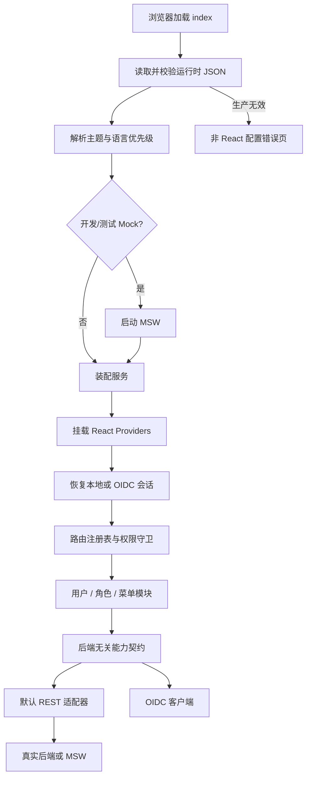
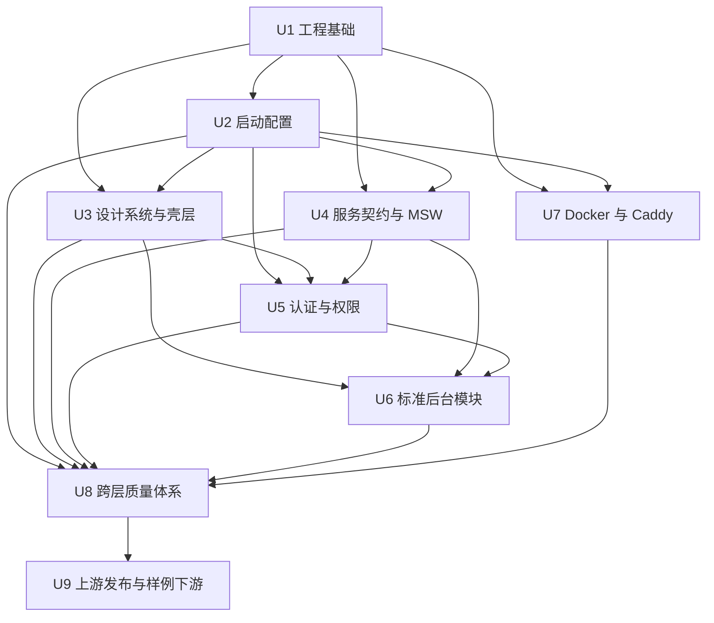

# feat: 构建可复用 React 中后台上游模板

## Summary

在当前工作区建立一个全新的单仓库 React 上游模板：复用 OPL 已验证的 React 工程模式和“设计令牌唯一真相”思路，重新建设启动前运行时配置、双认证、默认拒绝权限、后端适配器、MSW、QRouter 风格响应式壳层、标准后台模块及 Caddy 交付链路。现有 QRouter 静态代码只作为视觉和交互基准，不进入稳定模板版本。

---

## Problem Frame

当前仓库只有 6 个静态 HTML 页面及共享 CSS/JavaScript，缺少可维护的 React 工程、认证与权限边界、测试和部署能力；OPL 虽有可借鉴骨架，但混入了 Open WebUI 专属接口、布局和令牌存储方式。实施必须同时解决“当前原型可一比一迁移”和“模板长期可被独立下游升级”两个约束，而不能把某个业务仓库直接复制成上游。

---

## Requirements

以下 R-ID 均继承自 [需求文档](../brainstorms/2026-07-10-react-admin-upstream-template-requirements.md)。

**模板仓库与上游关系**

- R1. 交付单一 Git 仓库，不采用 Monorepo 或共享 npm 包。
- R2. 下游项目保持独立仓库，并可把模板作为可选 `upstream` 接收升级。
- R3. 上游通过稳定版本、变更记录和升级说明发布，不要求下游追踪主分支。
- R4. 明确模板核心与下游定制边界，降低但不承诺消除升级冲突。

**视觉、主题与国际化**

- R5. 提供去 QRouter 品牌和业务后的默认皮肤，桌面与移动端复刻原型已有布局和交互。
- R6. 使用可二次封装或自行实现的组件源码，并以视觉回归和 WCAG 2.2 AA 为验收基线。
- R7. 支持亮色、暗色、跟随系统三种主题，并持久化用户选择。
- R8. 只内置 `zh-CN` 与 `en-US`，持久化用户选择并按规则回退。

**运行时配置与启动**

- R9. React 启动前读取并校验运行时 JSON，覆盖 API、认证、默认主题和默认语言。
- R10. 首次加载按“用户偏好 → 运行时默认 → 系统/浏览器 → 最终回退”解析主题和语言。
- R11. 开发配置无效时可安全回退；生产配置无效时阻止启动，且安全配置不可被 URL、Hash 或 Local Storage 覆盖。

**认证、权限与标准模块**

- R12. 提供登录、用户、角色、菜单模块；用户、角色、菜单满足需求文档定义的标准 CRUD 与基础权限范围。
- R13. 标准模块依赖后端无关契约，并提供可用于开发和测试的 MSW Mock。
- R14. 支持本地登录、OIDC Authorization Code + PKCE 及混合模式，前端不保存 Client Secret。
- R15. 两类认证输出统一会话与权限；路由、菜单、操作默认拒绝，后端始终是最终授权方。
- R16. 覆盖会话恢复、显式退出、过期、未授权和 OIDC 回调失败流程。

**部署与质量**

- R17. 默认使用 Docker 多阶段构建和 Caddy 运行，同一镜像读取不同环境运行时配置。
- R18. 建立组件、启动、认证、权限、视觉、部署和上游升级的自动化验证，并维护独立样例下游。

**Origin actors:** A1 模板维护者、A2 下游开发者、A3 部署运维者、A4 后台最终用户。

**Origin flows:** F1 创建新项目、F2 接收上游升级、F3 首次加载、F4 认证与会话生命周期、F5 部署同一构建产物。

**Origin acceptance examples:** AE1–AE3 首次启动与配置优先级；AE4–AE5 双认证入口；AE6、AE11 上游升级；AE7 同镜像多环境；AE8 桌面/移动视觉；AE9 会话生命周期；AE10 标准 CRUD 与权限拒绝。

---

## Scope Boundaries

- 不把 `src/payg/` 中的充值、积分、发票、企业套餐等业务页面带入稳定模板。
- 不复制 OPL 的聊天、四栏布局、Open WebUI API、业务导航或 Local Storage Bearer Token 方案。
- 不采用 Monorepo、共享 npm 包、私有包仓库或需要发布组件包的架构。
- 不实现真实用户、角色、菜单、权限、本地认证或 OIDC 服务端。
- 不建设组织架构、多租户、数据权限、审批流或完整 IAM。
- 不允许运行时 JSON、URL、Hash 或 Local Storage 扩大可信 API/OIDC 来源。
- 不内置中英文之外的语言，不建设 RTL、自动翻译或多品牌主题系统。
- 不允许服务端动态下发任意前端代码或未知路由；服务端只能引用前端已注册的路由/权限键。
- 不承诺下游无冲突自动升级；冲突处理仍由下游维护者负责。
- 视觉基线以固定 Chromium 和固定视口为准，不在首版承诺所有浏览器像素级一致。

### Deferred to Follow-Up Work

- QRouter 充值消费业务的实际 React 页面迁移：在首个稳定模板标签之后，于独立下游项目实施。
- 额外浏览器的视觉基线：当具体下游明确要求 Safari、Firefox 或 WebView 像素级验收时单独增加。

---

## Context & Research

### Relevant Code and Patterns

- `src/assets/shared.css` 是当前视觉令牌、240px 桌面侧栏、64px 头部、768px 移动抽屉和 480px 紧凑视口的主要依据。
- `src/assets/shared.js` 提供现有主题、移动侧栏、遮罩、Esc 关闭、窗口变化和响应式提示行为；迁移时应保留行为，不保留全局函数写法。
- `src/assets/icons.svg` 可作为通用图标雪碧图来源，但稳定模板只能保留去品牌且实际使用的符号。
- `src/payg/*.html` 共有约 4,900 行，页面级样式还包含 1200px 布局变化；这些页面只用于提取共享模式和建立截图基线。
- OPL 参考仓库提交 `1c2b7a1` 的 `src/styles/tokens.css`、`src/index.css`、`src/components/ui/`、`src/i18n/`、`src/stores/` 展示了 React + Tailwind + 可修改 Radix/shadcn 源码的可行模式。
- OPL 的 `src/api/client.ts`、`src/stores/authStore.ts` 只能作为错误归一和会话状态组织方式参考；其 Open WebUI 路径及 Local Storage 令牌做法不应复用。
- 当前仓库没有 React package、自动化测试、`docs/solutions/` 或 `STRATEGY.md`，因此不能依赖本仓库既有工程约定。
- 用户提供的原型地址返回 HTTP 200；规划环境没有可用图形浏览器，实施开始后必须先补齐桌面和移动端原型截图基线。

### Institutional Learnings

- OPL 已验证 CSS 变量应是主题唯一真相，Tailwind 与组件语义变量只做映射，避免出现第二套颜色体系。
- 原型图标需要使用原始 SVG path/symbol，不能用相似图标替代需要一比一复刻的图标。
- i18n 应显式归一 `zh`、`zh-CN`、`en-*`，避免检测器把语言变体转换成未注册键。
- Radix `asChild` 与函数式 `className` 组合存在兼容风险，导航激活状态应产出普通字符串类名。

### External References

- [oidc-client-ts](https://github.com/authts/oidc-client-ts)：浏览器 OIDC/OAuth2 客户端，支持 Authorization Code + PKCE，不支持隐式授权。
- [Mock Service Worker](https://mswjs.io/docs)：在网络层拦截请求，使开发、单元/集成测试与生产适配器走同一请求路径。
- [Playwright visual comparisons](https://playwright.dev/docs/test-snapshots)：固定浏览器、字体和数据后的视觉快照基线。
- [RFC 7636](https://www.rfc-editor.org/rfc/rfc7636)：PKCE 协议依据。
- [Caddy `try_files`](https://caddyserver.com/docs/caddyfile/directives/try_files)：静态资源服务与 SPA 回退模式。

---

## Key Technical Decisions

- **当前工作区作为模板仓库目标。** 实施前先保留静态原型副本和截图基线，再用 React 工程替换根目录 `src/`；首个稳定标签不得包含 QRouter 业务源码。
- **采用 OPL 同类但独立锁定的技术栈。** 使用 React 19、Vite 8、TypeScript 6、pnpm 10、React Router 7、TanStack Query 5、Zustand 5、Tailwind 4 和 Radix/shadcn 源码。TypeScript 6 与当前 typescript-eslint 支持范围匹配；暂不为了“最新”切到 React Router 8 或 TypeScript 7。
- **不使用重视觉组件库。** 基础交互采用 Radix primitives，组件源码进入 `src/components/ui/`；精确外观由设计令牌、Tailwind 工具类和必要的自定义 CSS 控制，不引入 Ant Design/Material 的视觉约束。
- **把下游改动集中到明确边界。** `src/core/`、`src/components/`、`src/layouts/`、`src/modules/` 由模板维护；`src/project/` 负责品牌、导航、项目路由、服务装配、可信来源和样式覆盖。
- **运行时配置是启动门。** 入口先从 `/config/runtime.json` 加载版本化 JSON、校验可信 URL、解析主题/语言、按需启动 MSW，再动态加载 React 应用；生产失败使用非 React 的可诊断错误页。仓库只提交 `public/config/runtime.example.json`，实际 `public/config/runtime.json` 必须被 Git 忽略，并由各环境部署时挂载或写入。
- **安全配置与用户偏好分离。** Local Storage 只保存主题和语言等非安全偏好；API、认证模式、OIDC 参数和可信来源不得由浏览器持久化或 URL 覆盖。
- **本地登录默认 Cookie 会话。** 默认 REST 适配器使用 `credentials: include` 恢复和退出服务端会话；需要 Bearer Token 的下游替换适配器，不在模板核心加入长期令牌存储。
- **Cookie 会话必须声明跨源与 CSRF 契约。** 默认优先同源部署；当 `local` 或 `hybrid` 使用跨源 API Cookie 时，项目编译期可信策略必须为精确 HTTPS Origin 显式允许 credentialed Cookie。客户端使用 `credentials: include`，服务端必须返回精确 `Access-Control-Allow-Origin` 和 `Access-Control-Allow-Credentials: true`，不得使用通配 Origin；跨站 Cookie 必须使用 `SameSite=None; Secure; HttpOnly`，所有状态变更请求仍须满足 adapter 的 CSRF token/header 契约。配置不满足时启动拒绝，响应不满足时认证失败且不得降级为不安全模式。
- **OIDC 使用专用客户端。** 使用 `oidc-client-ts` 处理 state、nonce、PKCE、回调和过期事件，用户对象存 `sessionStorage`；登录来源被归一成统一 Session，不把 Client Secret 放入前端。
- **OIDC 身份不能直接授予应用权限。** OIDC 回调成功后仍须通过应用会话 adapter 解析当前用户和 capabilities；ID Token/用户信息只证明身份，未知或未映射 claim 不产生权限。
- **认证可观测性默认脱敏。** 页面错误、应用日志、网络诊断和测试产物不得记录 token、authorization code、认证 Header、完整回调查询串或真实 PII；认证测试只使用虚拟用户和可丢弃凭据，并禁止把认证态写入持久化 Playwright `storageState`。
- **hybrid 恢复必须确定且幂等。** 当前浏览器会话保存非敏感的认证来源标记并只恢复该来源；来源失效后回到登录选择，不自动切换成另一账号来源。恢复、401 和退出使用 single-flight/幂等处理，避免 React StrictMode 或并发请求重复执行。
- **端口/适配器隔离后端。** 标准模块只依赖用户、角色、菜单、认证等能力契约；默认 REST 适配器和 `src/project/` 装配实现契约，MSW 在网络层拦截同一 HTTP 请求。所有 Session、capabilities、用户、角色和菜单原始响应都必须先在 adapter 边界通过 Zod 校验，再映射为领域对象；认证或权限响应校验失败时默认拒绝。
- **路由代码归前端所有。** 路由注册表同时提供路由、导航和权限元数据；后端菜单只能控制已知条目的显示、顺序与授权，未知键默认忽略并拒绝。
- **权限默认拒绝。** 路由守卫、导航过滤和操作按钮统一消费 capability 集合；缺失、解析失败或会话过期时均按无权限处理，并清理相关 Query Cache。登录后优先恢复安全且已授权的 `returnTo`，否则进入注册表中第一个有权限的导航路由；没有任何授权路由时显示专用无权限页。
- **原型断点直接成为壳层契约。** 桌面保留 240px 侧栏和 64px 头部；`<=768px` 使用抽屉、遮罩和滚动锁；`<=480px` 使用紧凑字号/间距；页面级 1200px 规则只在需要的标准模块中复用。
- **视觉验收使用固定环境。** 基准视口为 1440×900、768×1024、390×844；固定 Chromium、字体、Mock 数据和动画状态，自动差异阈值仅容忍抗锯齿噪声，任何基线更新必须人工审核。
- **Caddy 只服务静态产物和运行时配置。** `runtime.json` 禁止缓存，`index.html` 短缓存/不缓存，带 hash 的资源长期 immutable；配置 SPA 回退、压缩、安全响应头和部署侧 CSP 连接来源。
- **Mock worker 生命周期由 bootstrap 管理。** 运行时配置必须在 worker 启动前读取；生产启动显式清理模板已知的 MSW worker，防止同源环境曾运行开发版后残留 worker 继续拦截请求。浏览器 Mock 会话仅在开发/测试中由 handlers 私有的 `sessionStorage` 存储维持，Node 测试使用隔离内存实现；应用仍走真实 HTTP 契约，不读取该存储，也不伪装成真实 HttpOnly Cookie。
- **上游使用简单稳定发布模型。** `main` 始终可发布，采用语义化标签和逐版本升级说明；下游以 `upstream` remote 获取选定标签，不引入长期 `develop` 分支。
- **样例下游保持独立仓库。** 它只修改约定的项目定制区，并用于验证品牌、导航、适配器替换以及相邻稳定版本升级，不放进模板仓库形成 Monorepo。

---

## Open Questions

### Resolved During Planning

- **上游分支和版本方式：** 使用可发布 `main`、语义化稳定标签、`CHANGELOG.md` 和逐版本升级文档；下游把模板配置为 `upstream`。
- **模板与项目边界：** 模板维护 `core/components/layouts/modules`，下游主要维护 `project` 目录和运行时配置。
- **运行时配置严格性：** Vite 开发模式允许安全默认值；所有生产构建都要求有效同源 JSON，否则不挂载 React。
- **认证与存储：** 本地认证默认服务端 Cookie；OIDC 使用 Code + PKCE 和 `sessionStorage`；两者归一到同一 Session/Permission 模型。
- **Caddy 行为：** 运行时配置 no-store、入口不长期缓存、hash 资源 immutable、SPA fallback、压缩和安全头；跨源连接策略由部署侧 CSP 与代码可信来源共同限制。
- **视觉基准：** 使用 1440×900、768×1024、390×844；固定 Chromium、字体、动画与测试数据，并先采集原型基线。

### Deferred to Implementation

- **最终仓库名和默认中性品牌文案：** 不影响架构，初始化仓库时确定并只落在 `src/project/` 与文档中。
- **具体 OIDC 提供方差异：** discovery、登出端点、刷新令牌和身份 claim 映射由下游 IdP 实测后配置；应用 capabilities 始终由应用会话 adapter 提供，不从未知 IdP claim 自动推断。
- **真实后端端点和字段映射：** 默认 REST 适配器采用示例约定，实际项目在 `src/project/` 替换，不进入模板核心。
- **最终视觉差异数值：** 先在固定容器浏览器与字体环境采集基线，再选择能过滤抗锯齿但不能掩盖布局差异的最小阈值。
- **Caddy 与 Node 镜像补丁版本/digest：** 实施时选择当日稳定补丁并写入锁定值，不在计划中绑定会过期的补丁号。

---

## Output Structure

```text
.
├── public/
│   ├── config/runtime.example.json  # 实际 runtime.json 由部署提供且不纳入版本控制
│   ├── icons.svg
│   └── mockServiceWorker.js
├── src/
│   ├── app/                 # 应用组合、providers、路由注册
│   ├── bootstrap/           # React 启动前配置与偏好初始化
│   ├── core/                # 配置、HTTP、认证、权限、服务契约、主题、i18n
│   ├── adapters/rest/       # 默认 REST 契约实现
│   ├── components/
│   │   ├── ui/              # 可修改的 Radix/shadcn 基础组件源码
│   │   └── common/          # 表格、状态页、权限入口等共享组件
│   ├── layouts/             # QRouter 风格响应式应用壳层
│   ├── modules/
│   │   ├── auth/
│   │   ├── users/
│   │   ├── roles/
│   │   └── menus/
│   ├── mocks/               # 浏览器/Node 共用 MSW handlers 和固定数据
│   ├── project/             # 下游品牌、导航、路由、适配器装配、可信来源、覆盖样式
│   ├── styles/              # 设计令牌、全局与响应式基础样式
│   └── test/                # Vitest/RTL 公共测试设施
├── tests/
│   ├── e2e/
│   ├── visual/
│   ├── a11y/
│   ├── deploy/
│   └── upgrade/
├── deploy/Caddyfile
├── docs/architecture/
├── docs/upgrading/
├── Dockerfile
├── playwright.config.ts
├── vitest.config.ts
└── package.json
```

该结构是计划边界，不是不可调整的代码规格；实施中如出现更清晰的同级命名，可保持职责不变后调整。

---

## High-Level Technical Design

> _本图用于说明预期组件关系和启动顺序，是评审方向，不是需要逐字复制的实现规格。_



认证模式的呈现和装配规则：

| 运行模式 | 登录页入口     | 会话来源           | 必需配置                              |
| -------- | -------------- | ------------------ | ------------------------------------- |
| `local`  | 账号密码       | 本地认证适配器     | API 配置                              |
| `oidc`   | 单一 OIDC 入口 | OIDC 客户端        | authority、client ID、回调路径、scope |
| `hybrid` | 两类入口       | 用户本次选择的来源 | API 配置 + 完整 OIDC 配置             |

---

## Implementation Units



### U1. 建立干净工程基础与下游扩展边界

**Goal:** 在不污染稳定模板的前提下保留原型依据，建立可构建的 React/TypeScript 单仓库和明确的模板/项目职责边界。

**Requirements:** R1, R2, R3, R4；支持 F1、F2。

**Dependencies:** None

**Files:**

- Create: `package.json`, `pnpm-lock.yaml`, `vite.config.ts`, `tsconfig.json`, `tsconfig.app.json`, `tsconfig.node.json`
- Create: `eslint.config.js`, `.prettierrc.json`, `.prettierignore`, `.gitignore`, `components.json`
- Create: `vitest.config.ts`, `playwright.config.ts`
- Create: `index.html`, `src/main.tsx`, `src/app/App.tsx`, `src/app/providers.tsx`
- Create: `src/project/branding.ts`, `src/project/navigation.ts`, `src/project/routes.tsx`, `src/project/styles.css`
- Create: `src/test/setup.ts`, `src/test/render.tsx`, `docs/architecture/extension-boundaries.md`, `README.md`
- Reference only before replacement: `src/assets/shared.css`, `src/assets/shared.js`, `src/assets/icons.svg`, `src/payg/*.html`
- Test: `src/app/App.test.tsx`, `tests/e2e/smoke.spec.ts`

**Approach:**

- 在初始化干净 Git 历史前，先把当前静态原型保存在不属于稳定模板的参考仓库/标签并记录其来源；替换 `src/` 后同步更新需求和计划中的来源说明，稳定标签中不保留失效的本地 `payg` 路径或业务源码。
- 使用 Node 24 LTS 构建基线和 pnpm 10 `packageManager` 锁定；依赖版本由 lockfile 固定。
- 开启 TypeScript 严格检查、路径别名、ESLint flat config 和 Prettier；质量命令覆盖 typecheck、lint、unit、e2e、visual、build。
- 应用组合层只负责装配；下游扩展集中在 `src/project/`，模板核心不得反向依赖具体项目业务模块。
- 复用 OPL 的目录分层和组件源码思路，不复制其 API、导航、布局和认证实现。

**Execution note:** 先建立最小构建/测试闭环，再逐单元增加能力；不要一次复制 OPL 后再删除业务代码。

**Patterns to follow:**

- OPL `1c2b7a1` 的 `vite.config.ts`、`tsconfig.app.json`、`src/main.tsx` provider 组合方式。
- 用户提供的全局准则：简单优先、精准改动、每个阶段均可验证。

**Test scenarios:**

- Happy path：全新检出在锁定 Node/pnpm 环境安装后，类型检查、lint、基础单测和生产构建均成功。
- Happy path：`src/project/` 的中性品牌、空业务路由和导航能够被应用组合层加载，不需要修改模板核心。
- Error path：模板核心意外导入 `src/project/` 之外的业务路径或稳定构建包含 `src/payg/` 时，边界检查失败。
- Integration：根路由在后续启动配置完成后可渲染最小应用壳，不依赖 OPL 后端或任何真实服务。

**Verification:**

- 仓库已是独立可构建 React 项目，生产产物中不存在 QRouter 品牌和 payg 业务文件。
- 新项目需要改动的扩展点在文档和目录上都清晰可见。

### U2. 实现 React 启动前运行时配置、主题和国际化

**Goal:** 在首个 React 画面前完成运行时配置校验及主题/语言解析，并提供开发安全回退和生产阻断行为。

**Requirements:** R7, R8, R9, R10, R11；F3；AE1, AE2, AE3, AE7。

**Dependencies:** U1

**Files:**

- Create: `public/config/runtime.example.json`, `src/bootstrap/loadRuntimeConfig.ts`, `src/bootstrap/startApplication.ts`
- Create: `src/bootstrap/resolvePreferences.ts`, `src/bootstrap/renderBootstrapError.ts`
- Create: `src/core/config/runtimeConfig.ts`, `src/core/config/runtimeConfig.schema.ts`, `src/core/config/trustedOrigins.ts`
- Create: `src/project/trustedOrigins.ts`
- Create: `src/core/theme/themeStore.ts`, `src/core/theme/themeResolver.ts`
- Create: `src/core/i18n/index.ts`, `src/core/i18n/localeResolver.ts`
- Create: `src/core/i18n/locales/zh-CN.json`, `src/core/i18n/locales/en-US.json`
- Modify: `index.html`, `src/main.tsx`, `src/project/branding.ts`, `.gitignore`
- Test: `src/bootstrap/loadRuntimeConfig.test.ts`, `src/bootstrap/resolvePreferences.test.ts`
- Test: `src/core/config/runtimeConfig.test.ts`, `src/core/theme/themeResolver.test.ts`, `src/core/i18n/localeResolver.test.ts`
- Test: `tests/e2e/bootstrap.spec.ts`

**Approach:**

- 运行时配置使用显式 schema version，并包含 API、认证模式、OIDC 公共参数、默认主题、默认语言及仅开发/测试可用的 Mock 开关；只允许相对同源 URL 或项目编译时批准的 HTTPS 来源。
- 应用固定请求 `/config/runtime.json`；仓库只提供不含生产值的 `runtime.example.json` 并忽略实际文件。开发环境缺失实际文件时使用安全默认值并警告，生产环境必须由部署提供有效文件，否则阻止启动。
- `src/core/config/trustedOrigins.ts` 负责执行通用校验，实际允许列表来自 `src/project/trustedOrigins.ts`，避免下游修改模板核心。
- 对 `local`/`hybrid` + 跨源 API 的组合，`src/project/trustedOrigins.ts` 必须为精确 Origin 显式标记允许 credentialed Cookie；仅列入普通可信来源仍不足以通过生产校验。
- 配置请求使用浏览器 `no-store` 语义，并要求 OIDC redirect/post-logout 目标为当前应用已批准的同源路径，防止运行时配置制造开放重定向。
- `src/main.tsx` 只调用 bootstrap；有效配置和偏好应用完成后，才动态加载 React 应用及其 providers。
- 生产构建缺失/无效配置时显示可访问的纯 DOM 错误页，不挂载 React；Vite 开发模式使用安全默认值并输出可诊断警告。
- 主题保存“用户选择”而非仅保存解析后的亮/暗结果；`system` 模式监听系统变化。
- 语言只接受 `zh-CN`、`en-US`，把 `zh*` 归一为中文、`en*` 归一为英文，其他语言回退中文。
- 所有 Local Storage key 使用模板命名空间，只存主题和语言；读取异常时不阻止启动。
- 生产启动在装配服务前注销模板已知的 MSW worker；开发/测试只有在有效配置明确启用且当前构建允许时才注册 worker。

**Execution note:** 先用失败测试固定 AE1–AE3 的启动时序，再接入 React providers，避免后补时产生首屏闪烁。

**Patterns to follow:**

- `src/assets/shared.css` 的 `data-theme` 机制。
- OPL `1c2b7a1` 的主题和 i18n 初始化方式，但扩展为三态主题及运行时默认优先级。

**Test scenarios:**

- Covers AE1. 首次访问、配置为暗色 + 英文时，第一个可见应用画面已是暗色英文，不出现亮色或中文中间态。
- Covers AE2. 已保存亮色 + 中文、配置为暗色 + 英文时，仍采用用户偏好。
- Covers AE3. 生产配置缺失、JSON 损坏、schema version 不支持或 OIDC 配置不完整时，React 不挂载并显示具体错误类别。
- Happy path：未保存偏好且配置缺省主题/语言时，主题跟随系统，语言只在中英文中匹配浏览器。
- Edge case：`system` 模式下系统主题改变时，页面实时变化，但保存值仍为 `system`。
- Edge case：Local Storage 被禁用、内容损坏或含不支持值时，按运行时配置继续启动。
- Error path：API/OIDC 使用 HTTP 外部地址或不在项目可信列表时，生产校验失败。
- Security：`local`/`hybrid` 指向跨源 API，但项目可信策略未显式允许 credentialed Cookie、使用通配 Origin 或不是 HTTPS 时，生产校验失败。
- Security：OIDC redirect/post-logout 配置指向外部 origin 或未知站内路径时，生产校验失败。
- Security：URL 参数、Hash 和 Local Storage 中伪造的 API、authority、client ID 不改变已加载配置。
- Regression：浏览器曾注册模板 MSW worker 后再加载生产构建，worker 被注销且真实请求不再被 mock handler 接管。
- Integration：同一生产构建加载两份不同有效配置时，API、认证入口、默认主题和语言分别生效。

**Verification:**

- React 只在配置和首屏偏好完成后挂载。
- AE1–AE3、AE7 的启动行为均有自动化覆盖且无主题/语言闪烁。

### U3. 建立可修改设计系统和 QRouter 风格响应式壳层

**Goal:** 用去品牌的设计令牌和自有组件源码复刻原型共享视觉、桌面壳层及移动交互，同时达到公共组件无障碍基线。

**Requirements:** R5, R6, R7, R8；AE8。

**Dependencies:** U1, U2

**Files:**

- Create: `public/icons.svg`, `src/components/IconSprite.tsx`
- Create: `src/styles/tokens.css`, `src/styles/globals.css`, `src/styles/responsive.css`
- Create: `src/components/ui/button.tsx`, `src/components/ui/input.tsx`, `src/components/ui/select.tsx`
- Create: `src/components/ui/checkbox.tsx`, `src/components/ui/switch.tsx`, `src/components/ui/dialog.tsx`
- Create: `src/components/ui/dropdown-menu.tsx`, `src/components/ui/tooltip.tsx`, `src/components/ui/form.tsx`, `src/components/ui/toast.tsx`
- Create: `src/components/common/DataTable.tsx`, `src/components/common/Pagination.tsx`, `src/components/common/AsyncState.tsx`
- Create: `src/layouts/AppShell.tsx`, `src/layouts/Sidebar.tsx`, `src/layouts/AppHeader.tsx`, `src/layouts/UserMenu.tsx`
- Modify: `src/app/App.tsx`, `src/app/providers.tsx`, `src/project/branding.ts`, `src/project/navigation.ts`, `src/project/styles.css`
- Test: `src/components/ui/dialog.test.tsx`, `src/components/common/DataTable.test.tsx`
- Test: `src/layouts/AppShell.test.tsx`, `src/layouts/Sidebar.test.tsx`, `tests/visual/app-shell.spec.ts`, `tests/a11y/app-shell.spec.ts`

**Approach:**

- 从 `src/assets/shared.css` 提取准确颜色、阴影、尺寸、圆角和间距，重命名为去品牌语义令牌；Tailwind 与 shadcn 变量只映射到这一层。
- 仅从 `src/assets/icons.svg` 保留模板需要的通用符号，使用 sprite 组件复刻；非原型辅助图标才可使用通用图标库。
- 桌面壳层保持 240px 固定侧栏、64px sticky header 和内容间距；移动端变为抽屉 + 遮罩，支持点击遮罩、Esc、路由切换关闭和 body 滚动锁。
- `<=480px` 隐藏次要 header 文案并收紧按钮/卡片间距；表格的移动展示能力由共享 DataTable 提供，但具体列布局由模块声明。
- Dialog、Dropdown、Tooltip 等交互依赖 Radix 的焦点、键盘与语义能力，外观完全由模板样式控制。
- 主题和语言入口放在用户菜单/头部可访问控件中，支持键盘操作和可读标签。

**Execution note:** 先采集原型桌面/移动截图并建立共享壳层的视觉特征清单，再实现组件，避免凭印象近似。

**Patterns to follow:**

- `src/assets/shared.css` 的 `.sb`、`.mh`、`.card`、`.modal`、`.toast` 和响应式规则。
- `src/assets/shared.js` 的移动侧栏状态与 Esc/resize 清理行为。
- OPL `1c2b7a1` 的 token → Tailwind → shadcn 单向映射和 `IconSprite` 模式。

**Test scenarios:**

- Covers AE8. 1440×900 下侧栏、头部、卡片、按钮、表单、Dialog 的尺寸与颜色达到批准的原型基线。
- Covers AE8. 768×1024 下侧栏默认隐藏，导航按钮打开抽屉和遮罩；点击遮罩、Esc 或选择导航后关闭并恢复滚动。
- Covers AE8. 390×844 下副标题隐藏、卡片/按钮使用紧凑规格，页面无横向溢出。
- Happy path：主题切换后所有基础组件只通过令牌同步变化，不出现某组件仍使用另一套颜色。
- Accessibility：键盘可打开并关闭导航、菜单和 Dialog；Dialog 焦点被约束并在关闭后返回触发器。
- Accessibility：公共页面的 axe 扫描无 WCAG 2.2 AA 严重/高等级违规，文本与交互控件颜色对比满足阈值。
- Error path：导航数据为空或当前路由不存在时，壳层仍可渲染可诊断的空状态/404，而不是崩溃。

**Verification:**

- 桌面、平板边界和移动视口均有固定视觉基线。
- 组件源码可以直接二次修改，不依赖无法覆盖的第三方主题系统。

### U4. 定义后端能力契约、默认 REST 适配器和 MSW

**Goal:** 让认证、用户、角色和菜单模块完全依赖稳定前端契约，并用同一网络请求路径支持真实后端与本地 Mock。

**Requirements:** R13, R15, R18；支持 F1、F4 和 AE4、AE10。

**Dependencies:** U1, U2

**Files:**

- Create: `src/core/services/contracts.ts`, `src/core/services/ServicesProvider.tsx`, `src/core/services/useServices.ts`
- Create: `src/core/http/client.ts`, `src/core/http/errors.ts`, `src/core/http/unauthorized.ts`
- Create: `src/adapters/rest/authAdapter.ts`, `src/adapters/rest/userAdapter.ts`
- Create: `src/adapters/rest/roleAdapter.ts`, `src/adapters/rest/menuAdapter.ts`
- Create: `src/adapters/rest/schemas.ts`
- Create: `src/project/services.ts`
- Create: `public/mockServiceWorker.js`
- Create: `src/mocks/browser.ts`, `src/mocks/server.ts`, `src/mocks/handlers/index.ts`
- Create: `src/mocks/handlers/auth.ts`, `src/mocks/handlers/users.ts`, `src/mocks/handlers/roles.ts`, `src/mocks/handlers/menus.ts`
- Create: `src/mocks/data/fixtures.ts`
- Create: `src/mocks/sessionStore.ts`
- Test: `src/core/http/client.test.ts`, `src/adapters/rest/authAdapter.test.ts`, `src/adapters/rest/userAdapter.test.ts`
- Test: `src/adapters/rest/roleAdapter.test.ts`, `src/adapters/rest/menuAdapter.test.ts`, `src/mocks/handlers/handlers.test.ts`

**Approach:**

- 契约描述前端需要的行为和稳定领域对象，不暴露某个后端的 URL、分页字段或错误格式。
- 默认 REST 适配器先使用 Zod 校验 Session、capabilities、用户、角色、菜单和分页响应，再把示例 API 映射成契约；真实项目只替换适配器或 `src/project/services.ts` 装配。认证/权限响应缺字段、类型错误或包含未知权限结构时不构造部分 Session，而是返回默认拒绝的协议错误。
- HTTP 客户端支持运行时 base URL、Cookie、可选 access token provider、超时/取消和统一错误类型；401 只发出统一未授权信号，不直接操作 UI。
- 跨源 Cookie 请求仅对项目编译期显式批准的精确 HTTPS Origin 使用 `credentials: include`；CORS、Cookie 属性或 CSRF 契约不满足时返回可诊断认证错误，不重试为无凭据请求。
- HTTP 客户端为本地 Cookie adapter 提供可替换的 CSRF token/header 注入点；具体 token 获取与刷新属于 adapter，不硬编码成某个后端协议。
- MSW browser/server 共用 handlers 与固定数据，模拟成功、空数据、验证失败、无权限、未授权和服务错误。
- 浏览器 handlers 通过仅 Mock 代码可访问的 `sessionStorage` 会话记录维持刷新前后的登录状态；Node handlers 注入每测试隔离的内存存储。应用和 adapter 始终通过登录、会话恢复、退出 HTTP 端点交互，不直接访问 Mock 存储，也不声称模拟了浏览器不可写的 HttpOnly Cookie。
- Mock 仅允许在开发或测试构建启动；生产配置请求启用 Mock 时直接拒绝启动，避免误部署模拟数据。
- TanStack Query hooks 后续只调用契约，不直接调用 fetch。

**Execution note:** 契约和 REST 映射先用测试固定，再实现 MSW handlers，确保 Mock 不是另一套绕过适配器的业务实现。

**Patterns to follow:**

- OPL `1c2b7a1` 的 API 错误归一和 401 事件思想，但移除硬编码路径与 Local Storage 令牌。
- MSW 官方建议的 browser/node 共用 handlers 模式。

**Test scenarios:**

- Happy path：用户、角色、菜单 REST 响应被适配成相同领域对象，模块无需知道后端字段名。
- Happy path：同一 adapter 测试分别连接 MSW server 和浏览器 worker 时返回一致结果。
- Edge case：空响应、204、分页总数为 0、可选字段缺失时返回稳定领域值。
- Error path：Session、capabilities、用户、角色或菜单响应不满足 Zod schema 时，adapter 返回协议错误；认证与授权路径保持未认证/无权限状态。
- Error path：网络错误、超时、非 JSON 错误、验证错误、403、401、500 被归一成可区分错误。
- Security：跨源 API 不在项目可信列表时，请求在发出前被拒绝。
- Integration：401 只触发一次未授权事件；后续由认证层统一清理会话和 Query Cache。
- Security：需要 CSRF 的 Mock 场景在 token/header 缺失或失效时拒绝 state-changing 请求，正确 token 时才允许。
- Integration：Mock 登录后同一标签页刷新可恢复会话，退出会清除会话，新浏览器会话不会继承；这些行为仍经过真实 adapter HTTP 路径。
- Regression：生产构建不会启动或暴露 Mock 会话存储，且运行时配置无法启用它。
- Error path：生产构建中运行时配置启用 Mock 时，应用阻止启动并给出明确配置错误。

**Verification:**

- 切换 Mock/真实后端不需要修改用户、角色、菜单页面。
- 所有失败路径都有稳定错误分类，认证层和 UI 可以统一处理。

### U5. 实现本地登录、OIDC 会话和默认拒绝权限体系

**Goal:** 为本地、OIDC 和混合模式提供统一会话生命周期，并让路由、导航和操作共享同一权限判定。

**Requirements:** R14, R15, R16；F4；AE4, AE5, AE9, AE10。

**Dependencies:** U2, U3, U4

**Files:**

- Create: `src/core/auth/session.ts`, `src/core/auth/authService.ts`, `src/core/auth/authStore.ts`
- Create: `src/core/auth/localAuth.ts`, `src/core/auth/oidcAuth.ts`, `src/core/auth/authEvents.ts`
- Create: `src/core/permissions/capabilities.ts`, `src/core/permissions/authorize.ts`, `src/core/permissions/Can.tsx`
- Create: `src/modules/auth/LoginPage.tsx`, `src/modules/auth/LocalLoginForm.tsx`, `src/modules/auth/OidcLoginButton.tsx`
- Create: `src/modules/auth/OidcCallbackPage.tsx`, `src/modules/auth/AuthErrorPage.tsx`
- Create: `src/modules/auth/NoPermissionPage.tsx`
- Create: `src/app/router.tsx`, `src/app/routeRegistry.ts`, `src/app/RequireAuth.tsx`, `src/app/RequirePermission.tsx`
- Modify: `src/app/App.tsx`, `src/app/providers.tsx`, `src/project/routes.tsx`, `src/project/navigation.ts`
- Test: `src/core/auth/authService.test.ts`, `src/core/auth/oidcAuth.test.ts`
- Test: `src/core/permissions/authorize.test.ts`, `src/app/RequirePermission.test.tsx`
- Test: `src/modules/auth/LoginPage.test.tsx`, `tests/e2e/auth.spec.ts`, `tests/e2e/permissions.spec.ts`

**Approach:**

- 统一 Session 包含用户、认证来源、有效期和 capabilities；本地/OIDC 细节封装在 auth source 中。
- 本地登录默认调用 REST auth adapter，并依赖服务端 HttpOnly Cookie；前端不持久化密码或长期访问令牌。
- OIDC 使用 `oidc-client-ts`，UserManager 的用户存储限定为 `sessionStorage`；库负责 PKCE、state、nonce、回调和过期事件。
- 本地或 OIDC 协议认证成功后，都调用应用会话 adapter 获取规范化用户与 capabilities；OIDC token/claim 本身不直接驱动菜单或授权。
- hybrid 登录成功时在 `sessionStorage` 保存非敏感来源标记；恢复只尝试该来源，失败后清理标记并返回登录选择，避免静默切换到另一个已登录账号。
- 路由注册表保存 route key、path、导航元数据和所需 capability；导航和守卫从同一注册表派生。
- `RequireAuth` 只处理认证，`RequirePermission` 处理授权；未知 capability、未知路由键、空权限或解析失败均拒绝。
- 401、显式退出和过期统一清理认证状态、权限和 Query Cache，再回到可重试登录页。
- bootstrap、401 清理和退出均使用幂等/single-flight 边界，避免 StrictMode 双 effect 或多个并发 401 重复重定向、重复远端退出。
- 登录前目标路径只有同时满足站内、已注册且当前 Session 已授权时才可恢复；否则按项目导航顺序进入第一个有权限的已注册路由。若不存在任何授权路由，显示专用无权限页，不循环跳回登录页。
- OIDC 回调失败只保留错误类别、阶段和可选关联 ID；回调 URL 在读取参数后立即清理，页面、日志和网络诊断不得包含 token、authorization code、认证 Header、完整查询串或真实 PII。

**Execution note:** 从 authService 和 authorize 的失败测试开始，再接路由与页面；认证安全行为不能只靠 E2E 覆盖。

**Patterns to follow:**

- OPL `1c2b7a1` 的会话状态机和受保护路由分层。
- `oidc-client-ts` 的 Authorization Code + PKCE、session/access token 生命周期能力。

**Test scenarios:**

- Covers AE4. hybrid 模式分别通过本地和 OIDC 登录后，页面用同一 Session/Capability 接口读取用户和权限。
- Covers AE5. local、oidc、hybrid 三种配置只展示允许的入口；OIDC-only 只显示单一 OIDC 入口，不增加未定义的自动跳转配置。
- Covers AE9. 有效本地/OIDC 会话刷新受保护页面后恢复目标路由；恢复期间不短暂显示登录页或受保护内容。
- Covers AE9. 会话过期或 401 时清理会话、权限和 Query Cache，返回带安全站内 returnTo 的登录页。
- Security：OIDC 协议认证成功但应用会话解析失败或返回空 capabilities 时，不进入 authenticated 状态，也不从 ID Token role claim 自动授权。
- Edge case：hybrid 模式存在本地 Cookie 和 OIDC 会话时，只恢复当前来源标记对应账号；该来源失效后显示登录选择，不自动切换用户。
- Edge case：StrictMode 双启动和多个并发 401 只执行一次恢复/清理/重定向，状态最终一致。
- Error path：OIDC 用户取消、state/nonce 校验失败、回调缺参、provider 错误时进入可重试错误状态。
- Security：配置、bundle、Local Storage 中不存在 Client Secret；OIDC user 数据只出现在 `sessionStorage`。
- Security：本地 Cookie 的 state-changing 请求可按 adapter 要求携带 CSRF token；缺失/失效时保持未修改状态并显示授权错误。
- Security：外部 returnTo、未知路由、未知 capability、空 capability 集均被拒绝。
- Happy path：无 `returnTo` 或目标无权限时，本地/OIDC 登录均进入第一个有权限的已注册导航路由。
- Edge case：Session 有效但没有任何已注册路由权限时显示专用无权限页，刷新后状态稳定且不会发生登录/路由重定向循环。
- Covers AE10. 无角色管理权限时，直接访问路由、显示导航或调用操作均被前端拒绝，Mock/后端仍返回 403。
- Integration：显式退出根据认证来源调用相应服务端/OIDC 退出流程，即使远端退出失败也会清理本地状态并显示可重试提示。

**Verification:**

- 三种认证模式、会话恢复和失败路径均有单元与 E2E 覆盖。
- 路由、菜单和操作不会出现三套互相不一致的授权逻辑。

### U6. 实现用户、角色和菜单标准后台模块

**Goal:** 使用共享契约和设计系统交付需求限定的 CRUD 与基础权限配置，并保证桌面/移动端可用和可测试。

**Requirements:** R12, R13, R15；AE10。

**Dependencies:** U3, U4, U5

**Files:**

- Create: `src/modules/users/routes.tsx`, `src/modules/users/UserListPage.tsx`, `src/modules/users/UserFormDialog.tsx`, `src/modules/users/UserRoleDialog.tsx`
- Create: `src/modules/users/queries.ts`, `src/modules/users/schema.ts`
- Create: `src/modules/roles/routes.tsx`, `src/modules/roles/RoleListPage.tsx`, `src/modules/roles/RoleFormDialog.tsx`, `src/modules/roles/RolePermissionDialog.tsx`
- Create: `src/modules/roles/queries.ts`, `src/modules/roles/schema.ts`
- Create: `src/modules/menus/routes.tsx`, `src/modules/menus/MenuTreePage.tsx`, `src/modules/menus/MenuFormDialog.tsx`, `src/modules/menus/MenuOrderControls.tsx`
- Create: `src/modules/menus/queries.ts`, `src/modules/menus/schema.ts`
- Modify: `src/project/navigation.ts`, `src/project/routes.tsx`
- Modify: `src/core/i18n/locales/zh-CN.json`, `src/core/i18n/locales/en-US.json`
- Test: `src/modules/users/UserListPage.test.tsx`, `src/modules/users/UserFormDialog.test.tsx`
- Test: `src/modules/roles/RoleListPage.test.tsx`, `src/modules/roles/RolePermissionDialog.test.tsx`
- Test: `src/modules/menus/MenuTreePage.test.tsx`, `src/modules/menus/MenuFormDialog.test.tsx`
- Test: `tests/e2e/system-admin.spec.ts`, `tests/visual/system-admin.spec.ts`, `tests/a11y/system-admin.spec.ts`

**Approach:**

- 使用 TanStack Query 管理列表、详情和 mutation；mutation 成功后做精确失效，不提前引入复杂乐观更新。
- 表单使用 react-hook-form + Zod；服务端验证错误映射到字段或表单级提示。
- 用户模块只实现列表、查询、新建、编辑、启停和角色分配，不擅自增加删除、导入导出或密码策略。
- 角色模块实现列表、新建、编辑、删除、启停和菜单/操作 capability 分配。
- 菜单模块实现树形查看、新建、编辑、删除、启停和排序；首版使用明确顺序/上下移动控制，不引入拖拽库。
- 远端菜单的 route key 必须存在于前端注册表；未知键显示诊断状态但不会生成可访问路由。
- 桌面使用表格/树结构；`<=768px` 列表转换为带字段标签的卡片布局，参考 `src/payg/members.html` 的移动表格行为。
- 每个模块包含 loading、empty、error、forbidden、success feedback 和删除确认状态。

**Execution note:** 按 users → roles → menus 顺序实现；先固定契约和 Mock 场景，再写页面，以避免 UI 反向决定后端模型。

**Patterns to follow:**

- `src/payg/members.html` 的桌面表格转移动卡片模式。
- `src/assets/shared.css` 的 card、button、modal、pagination 样式。
- U3 的共享 DataTable、Dialog、Form 和 AsyncState，不为每个模块复制组件。

**Test scenarios:**

- Covers AE10. 具备用户管理权限时，可查询、新建、编辑、启停并分配角色；无权限时路由和操作均拒绝。
- Happy path：角色可创建、编辑、启停、删除并分配已注册菜单/操作 capability。
- Happy path：菜单树可创建子项、编辑、启停、删除和调整相邻顺序，刷新后保持 Mock 返回顺序。
- Edge case：列表为空、搜索无结果、最后一页删除后页码越界时回到有效状态。
- Edge case：禁用当前用户、删除被引用角色或删除含子项菜单等业务约束由 adapter 返回明确错误，UI 不假设成功。
- Error path：字段验证、409 类冲突、403、会话过期和 500 分别显示合适提示；401 交给统一认证流程。
- Security：用户只能看到其 capability 允许的菜单和操作；通过 DOM 或 URL 直接触发仍会被前端与 Mock 拒绝。
- Responsive：1440、768、390 视口下表格/卡片、Dialog 和操作区无溢出，主要操作保持可访问。
- Accessibility：搜索、分页、树、Dialog、确认操作和状态提示具有可读标签、焦点顺序和键盘操作。
- Integration：模块调用默认 REST adapter 时与 MSW handlers 完成端到端 CRUD，不直接访问 mock data。

**Verification:**

- 用户、角色、菜单达到 R12 的明确边界，没有扩展成完整 IAM。
- AE10 在 Mock 模式、路由守卫和操作授权三个层面均被验证。

### U7. 提供 Docker 多阶段构建和 Caddy 运行配置

**Goal:** 用同一不可变前端镜像服务多个环境，并正确处理运行时配置、SPA 路由、缓存、压缩和安全响应头。

**Requirements:** R9, R10, R11, R17；F5；AE3, AE7。

**Dependencies:** U1, U2

**Files:**

- Create: `Dockerfile`, `.dockerignore`, `deploy/Caddyfile`, `deploy/runtime-config.example.json`
- Create: `docs/architecture/runtime-config.md`, `docs/architecture/deployment.md`
- Test: `tests/deploy/container.spec.ts`, `tests/deploy/caddy-headers.spec.ts`

**Approach:**

- builder 使用锁定 Node LTS + pnpm 完成 typecheck 和 build；runtime 使用锁定 Caddy 2 Alpine 补丁/digest，只复制静态产物和 Caddyfile。
- 运行时配置由挂载或发布系统写入静态目录；镜像只包含无生产值的示例文件，不包含实际 `runtime.json`，也不烘焙环境 API/IdP 值。
- Caddy 对 `/config/runtime.json` 返回 `no-store`，对 `index.html` 返回不长期缓存策略，对 hash 资源返回长期 immutable。
- 未命中静态文件的前端路由回退 `index.html`，真实不存在的资源和配置路径不得被 SPA 回退掩盖。
- 启用 gzip/zstd、MIME、安全响应头和默认同源 CSP；跨源 API/OIDC 的 `connect-src` 由部署侧受控变量扩展，并必须与代码可信来源一致。
- 优先使用非 root 用户和非特权端口；若官方镜像限制导致无法安全运行，在实施记录中明确而不是静默回退。

**Patterns to follow:**

- Vite hash 静态资源缓存惯例。
- Caddy `try_files` + `file_server` 的 SPA 部署模式。

**Test scenarios:**

- Covers AE7. 同一镜像分别挂载测试/生产配置后，API、认证模式、主题和语言不同，静态资源 digest 相同。
- Security：未挂载时镜像文件系统中不存在实际 `runtime.json`；挂载后配置可读取但不会被 Caddy 缓存。
- Covers AE3. 缺失/损坏运行时配置时容器仍能服务配置错误页，但 React 业务应用不启动。
- Happy path：直接访问深层受保护路由返回 `index.html` 并由客户端路由接管。
- Edge case：请求不存在的 JS/CSS、`runtime.json` 或 source map 时返回真实 404，不回退 HTML。
- Cache：运行时 JSON 不缓存，入口文档不长期缓存，hash 资源带 immutable。
- Security：响应包含内容类型、防嗅探、referrer、frame、permissions 和 CSP 相关安全头。
- Security：未配置部署侧跨源允许值时，外部 API/OIDC 连接被 CSP 或应用可信来源拒绝。
- Integration：容器以预期用户/端口运行，刷新路由、压缩和运行时配置加载均正常。

**Verification:**

- 一个镜像能完成 AE7 的多环境部署验证。
- 配置、入口和 hash 资源的缓存策略互不冲突，不会因旧配置导致错误环境连接。

### U8. 建立单元、集成、E2E、视觉和无障碍质量门

**Goal:** 把关键行为与一比一视觉要求转成可重复的自动化门，避免模板升级破坏启动、认证、权限或响应式表现。

**Requirements:** R6, R18；覆盖 AE1–AE10，并支撑 AE11。

**Dependencies:** U2, U3, U4, U5, U6, U7

**Files:**

- Modify: `vitest.config.ts`, `playwright.config.ts`, `src/test/setup.ts`, `src/test/render.tsx`
- Create: `tests/fixtures/runtime/`, `tests/fixtures/auth/`, `tests/fixtures/data/`
- Consolidate/Modify: `tests/e2e/bootstrap.spec.ts`, `tests/e2e/auth.spec.ts`, `tests/e2e/permissions.spec.ts`, `tests/e2e/system-admin.spec.ts`
- Consolidate/Modify: `tests/visual/app-shell.spec.ts`, `tests/visual/auth.spec.ts`, `tests/visual/system-admin.spec.ts`
- Consolidate/Modify: `tests/a11y/app-shell.spec.ts`, `tests/a11y/auth.spec.ts`, `tests/a11y/system-admin.spec.ts`
- Create: `scripts/verify-template.mjs`, `.github/workflows/quality.yml`
- Create: `docs/architecture/testing.md`

**Approach:**

- Vitest + React Testing Library 覆盖纯逻辑、store、契约、组件和失败路径；MSW Node server 复用浏览器 handlers。
- Playwright 使用固定 Chromium 和可重复 Mock 数据，按测试类型拆分 E2E、视觉、a11y、容器验证。
- 视觉项目固定 1440×900、768×1024、390×844，安装固定字体、关闭动画/光标/时间变化并统一截图背景。
- 自动阈值只过滤抗锯齿噪声；布局、字号、间距和颜色差异需要人工审核后才能更新 baseline。
- axe 扫描作为自动基线，仍保留键盘、焦点、语义和对比度的人工检查表。
- CI 按快速检查和浏览器检查分层，但发布标签前必须全部通过。
- `verify-template` 汇总生产 bundle 去品牌检查、边界检查、运行时配置样例校验和关键测试结果。
- 浏览器回归包含“开发 Mock → 生产构建”的同源切换，验证残留 Service Worker 被清理；认证回归包含 StrictMode 双启动与并发 401。
- 认证/OIDC 测试只使用虚拟用户、虚拟 PII 和可丢弃测试 IdP 凭据；不复用真实账号，不持久化认证 `storageState`。涉及回调码或认证 Header 的用例关闭 trace、video 和网络转储，截图只能发生在 URL 清理且页面脱敏之后。
- CI 在上传日志和浏览器产物前执行敏感模式检查；发现 Bearer/Header、token、authorization code、完整回调查询串或禁止的 PII 即失败并拒绝上传。

**Execution note:** 视觉基线必须先与原型并排人工批准；禁止直接把第一次 React 截图当作正确答案。

**Patterns to follow:**

- Playwright web-first assertion、隔离浏览器上下文和视觉快照。
- 原型固定数据与关闭动画的可重复截图原则。

**Test scenarios:**

- Covers AE1–AE3. 配置、偏好、生产阻断和首屏无闪烁在 E2E 中稳定复现。
- Covers AE4–AE5、AE9. 三种认证模式、回调失败、恢复、过期、401、退出完整覆盖。
- Covers AE8. 壳层、登录、用户、角色、菜单在三类基准视口与明暗主题下通过批准视觉基线。
- Covers AE10. 管理员与受限用户的路由、菜单、按钮和 Mock 后端拒绝均被覆盖。
- Accessibility：登录、壳层和标准模块 axe 扫描无阻断问题，并有键盘/焦点专项测试。
- Deploy：容器与本地开发的运行时配置解析结果一致。
- Regression：生产 bundle 中出现 QRouter 品牌、payg 路径、OPL API 或禁止的 Local Storage token key 时，验证失败。
- Regression：生产构建在存在旧 MSW worker 时仍访问 Mock 数据、或并发 401 产生多次退出/重定向时，验证失败。
- Security：认证失败与 OIDC 回调用例不会把 token、authorization code、认证 Header、真实 PII 或认证态文件写入控制台、DOM、截图、trace、video、测试报告或 `storageState`。
- Edge case：视觉测试在字体未安装、动画未禁用或数据不确定时主动失败并给出环境诊断，而不是更新基线。

**Verification:**

- 全部需求的高风险路径至少有一层自动化覆盖，认证和视觉有多层覆盖。
- 任何基线更新都可追溯到人工批准，CI 不会默默接受视觉漂移。

### U9. 建立稳定发布、升级说明和独立样例下游

**Goal:** 让模板可作为长期上游被新项目创建和选择性升级，并以独立样例仓库持续验证定制边界。

**Requirements:** R2, R3, R4, R18；F1、F2；AE6、AE11。

**Dependencies:** U8

**Files (template repository):**

- Create: `CHANGELOG.md`, `docs/architecture/upstream-workflow.md`, `docs/upgrading/README.md`
- Create: `docs/releases/release-checklist.md`, `tests/upgrade/template-upgrade.spec.ts`
- Create: `tests/upgrade/fixtures/project-overlay/`, `scripts/check-extension-boundaries.mjs`
- Modify: `README.md`, `package.json`, `.github/workflows/quality.yml`

**Companion repository (`react-admin-upstream-sample`, separate Git repository):**

- Create: `src/project/branding.ts`, `src/project/navigation.ts`, `src/project/routes.tsx`
- Create: `src/project/services.ts`, `src/project/trustedOrigins.ts`, `src/project/styles.css`
- Create: `public/config/runtime.example.json`, `README.md`；实际 `public/config/runtime.json` 由样例部署提供并忽略

**Approach:**

- `main` 只接收通过质量门的变更；稳定版本采用 SemVer 标签，0.x 阶段允许快速演进但每次仍提供变更记录和升级说明。
- 新下游从明确标签创建独立仓库，自己的远端为 `origin`，模板为 `upstream`；升级以目标标签为单位，不持续合并主分支。
- 升级文档按“破坏性变化、下游动作、冲突热点、验证清单”组织，并明确哪些 `src/project/` 文件预期由下游拥有。
- 样例下游必须更换品牌、导航、项目路由、可信来源和服务装配，同时不修改模板核心目录。
- `tests/upgrade/fixtures/project-overlay/` 在临时 Git 仓库中模拟同样定制，用于 CI 检查边界和合并结果；真实样例仓库负责人工/端到端证明。
- 首个稳定标签建立样例仓库；第一次真实相邻稳定版本发布时，必须先把样例从前一标签升级并关闭 AE11，之后该步骤成为固定发布门。
- 如果首个版本尚无前一稳定标签，AE11 明确标记为“等待下一稳定版本”，不得伪造已完成结论。

**Execution note:** 先发布质量完整的首个稳定标签再创建样例；不要把样例目录放入模板仓库来规避跨仓库验证。

**Patterns to follow:**

- Git 上游/下游 remote 与 SemVer 稳定标签惯例。
- U1 的扩展边界文档和 U8 的统一质量门。

**Test scenarios:**

- Covers AE6. 带项目定制 overlay 的临时下游选择目标标签升级后，定制文件保持、冲突只发生在记录的热点并通过全部质量检查。
- Covers AE11. 独立样例仓库从相邻稳定标签升级后，品牌、导航、路由、可信来源和适配器仍为样例值。
- Happy path：从稳定标签创建的新仓库在 Mock 模式不接后端即可登录并完成用户/角色/菜单流程。
- Edge case：下游修改模板核心文件时，边界检查和升级文档明确提示高冲突风险，但不阻止用户有意修改。
- Error path：缺少 CHANGELOG、升级说明、样例验证记录或质量门失败时，不允许发布稳定标签。
- Regression：模板发布产物不包含样例品牌、QRouter 品牌或样例后端配置。

**Verification:**

- F1、F2 有可重复文档和自动化辅助，不依赖维护者记忆。
- 首个相邻稳定版本发布后，AE11 在真实独立样例仓库中有留档结果。

---

## System-Wide Impact

- **Interaction graph:** 运行时配置决定 bootstrap、主题、语言、认证装配、API 和 Mock；认证状态决定 Query Cache、路由、导航和操作入口；服务契约同时被真实 adapter、MSW 和标准模块消费；应用会话 adapter 是 OIDC/本地身份转成应用用户与权限的唯一汇合点。
- **Error propagation:** 配置错误在 React 外终止；REST 原始响应先经 Zod 校验，协议错误再交给模块；认证/权限解析失败默认拒绝；401/过期进入统一认证事件；OIDC 回调错误进入专用可重试页；权限拒绝不转成通用网络错误。
- **State lifecycle risks:** 主题/语言只持久化非安全偏好；OIDC 用户和 hybrid 来源标记只存当前浏览器会话；浏览器 Mock 会话仅由开发/测试 handlers 使用 `sessionStorage`；本地认证依赖服务端 Cookie、credentialed CORS 与 CSRF 契约；退出/401 必须同步清除 auth、permission 和 Query Cache；`system` 主题监听器需要在生命周期结束时释放。
- **Concurrency/idempotency:** React StrictMode、多个并发 401、OIDC 过期事件和用户点击退出可能同时触发状态转换；认证恢复和清理必须 single-flight 且重复调用安全。
- **Service Worker lifecycle:** 运行时配置必须先于 MSW，生产模式必须注销模板 worker；否则旧开发 worker 可能跨部署继续拦截 API。
- **API surface parity:** local/oidc/hybrid 三种模式必须输出相同 Session；Mock 和真实 REST adapter 必须满足同一 contracts；桌面表格和移动卡片必须提供相同操作与权限语义。
- **Integration coverage:** 单元测试不能证明首屏无闪烁、OIDC 重定向、跨源 credentialed Cookie、Caddy 回退、运行时多环境和视觉一致性，这些由 Playwright、测试服务、容器和样例下游覆盖。
- **Unchanged invariants:** 后端仍是最终授权方；前端不会实现服务端 IAM 或自动生成未知路由；下游仍可自行替换组件和适配器；上游升级仍允许人工解决冲突。

---

## Alternative Approaches Considered

- **直接复制 OPL 当前仓库再删业务：** 起步快，但会带入聊天、布局、API、Local Storage token 和未提交改动，无法形成可信的干净上游，因此拒绝。
- **从 OPL 干净提交完整 fork：** 比复制当前仓库安全，但其视觉、移动范围和认证目标不同；只复用模式和依赖选择，不复用业务结构。
- **使用 Ant Design/Material 作为完整视觉系统：** CRUD 组件成熟，但一比一复刻需要持续覆盖内部样式，且不利于源码级定制，因此不采用。
- **发布共享组件 npm 包：** 可统一多项目，但增加包版本、发布和多仓库协调成本，与用户确认的单模板仓库目标冲突。
- **让后端动态生成路由：** 可减少前端配置，但会把未知路径与权限解释带入运行时，增加安全和升级风险；改为代码注册路由 + 后端引用已知键。
- **把样例下游放进 `examples/`：** 容易自动化，但不能证明真实独立仓库升级，且趋向 Monorepo；保留外部样例仓库并用临时 fixture 辅助 CI。

---

## Success Metrics

- 新仓库在没有真实后端时可通过 Mock 完成本地登录和用户/角色/菜单核心流程。
- local、oidc、hybrid 三种配置的入口、恢复、退出和失败流程通过自动化验收。
- 生产配置错误不会挂载 React；同一镜像使用不同有效配置可表现为不同环境。
- 桌面和移动基准视口的共享壳层及标准模块通过人工批准的视觉基线与 a11y 门。
- 稳定模板产物中不存在 QRouter/OPL 业务代码、品牌或敏感配置。
- 下游只修改约定定制区即可更换品牌、导航、可信来源和服务适配器。
- 首个相邻稳定版本发布时，独立样例下游完成真实升级并保留全部项目定制。

---

## Dependencies / Prerequisites

- 实施开始前必须确保现有静态原型有可恢复副本，并能在本地服务中继续访问用于截图。
- 需要可运行的 Node 24/pnpm、Docker 和 Playwright Chromium 环境；视觉基线还需要固定字体包。
- OIDC 端到端验证需要一个支持 Authorization Code + PKCE 的隔离测试 IdP，只允许虚拟用户和可丢弃凭据；没有 IdP 时先用客户端单元测试和模拟回调，真实验证保持显式未完成。
- 独立样例下游需要单独的 Git 仓库位置和远端；它不能成为模板仓库子目录。
- 部署跨源 API/OIDC 时，运行时 JSON、代码可信来源和 Caddy CSP 必须由同一部署变更协调；跨源 Cookie 还必须由后端配置精确 credentialed CORS、合适的 SameSite/Secure/HttpOnly Cookie 与 CSRF 防护。

---

## Risk Analysis & Mitigation

| Risk                                          | Likelihood | Impact | Mitigation                                                                                                                                                         |
| --------------------------------------------- | ---------- | ------ | ------------------------------------------------------------------------------------------------------------------------------------------------------------------ |
| 当前 `src/` 原型在脚手架过程中被覆盖          | 中         | 高     | U1 首步保留可恢复副本和截图清单；首个稳定提交前验证原型仍可访问                                                                                                    |
| OIDC 提供方在 refresh、logout、claim 上有差异 | 高         | 高     | 标准逻辑放专用 adapter；provider 差异留在运行时/项目装配；使用真实测试 IdP 验证                                                                                    |
| OIDC claim 被错误当作应用权限                 | 中         | 高     | 所有认证来源都必须经过应用会话 adapter；空/未知 claim 默认无权限                                                                                                   |
| Cookie 登录的 CORS、Cookie 或 CSRF 协议不完整 | 中         | 高     | 同源优先；跨源仅允许编译期显式批准的精确 HTTPS Origin，要求 credentialed CORS、合适的 SameSite/Secure/HttpOnly Cookie 和 CSRF token/header；配置或响应不满足时拒绝 |
| sessionStorage token 仍受 XSS 影响            | 中         | 高     | 严格 CSP、禁止 token 日志/DOM 暴露、最小会话存储和明确过期清理；不使用 Local Storage 长期保存                                                                      |
| 认证秘密或真实 PII 进入日志和 CI 产物         | 中         | 高     | 统一错误脱敏；回调后清理 URL；使用虚拟账号；认证用例不持久化 storageState 并关闭含秘密的 trace/video/网络转储；上传前扫描                                          |
| hybrid 同时存在两种有效会话导致恢复错账号     | 中         | 高     | 保存当前来源标记，只恢复该来源；失效后回到登录选择，不静默 fallback                                                                                                |
| StrictMode 或并发 401 导致重复恢复/退出       | 中         | 中     | auth 操作 single-flight、幂等清理和并发回归测试                                                                                                                    |
| 旧 MSW Service Worker 在生产同源残留          | 低         | 高     | 生产 bootstrap 注销已知 worker，并增加开发版切生产版回归场景                                                                                                       |
| 运行时 JSON 与 CSP/可信来源不一致             | 中         | 高     | 启动时校验、部署文档、容器集成测试和同一发布变更清单                                                                                                               |
| 权限在路由、菜单、操作之间漂移                | 中         | 高     | 单一路由注册表与 capability 判定；AE10 同时覆盖三个入口                                                                                                            |
| 移动表格/树在数据量和操作数量下溢出           | 中         | 中     | 共享移动卡片模式、固定 768/390 视觉与键盘测试；不依赖横向滚动作为默认方案                                                                                          |
| 视觉快照受字体和抗锯齿影响频繁波动            | 高         | 中     | 固定浏览器镜像、字体、动画和数据；自动阈值最小化；baseline 更新需人工批准                                                                                          |
| 模板核心与下游定制边界不够稳定                | 中         | 高     | `src/project/` 单向扩展、边界检查、独立样例和相邻版本升级门                                                                                                        |
| 依赖追求最新导致工具链不兼容                  | 中         | 中     | 采用经验证主版本、lockfile 和 Node/pnpm 固定；大版本升级作为独立计划                                                                                               |
| Mock 或 Mock 会话状态被误带入生产             | 低         | 高     | Mock 会话存储仅开发/测试可导入；生产 bootstrap 显式拒绝 Mock；bundle/容器回归检查                                                                                  |
| 实际运行时配置被提交或烘焙进镜像              | 中         | 高     | 只提交无生产值的示例，忽略实际 runtime.json；生产由部署挂载，并检查镜像内容                                                                                        |
| 首版范围过大导致无法验证                      | 中         | 高     | 按 U1–U9 依赖分阶段落地，每个单元保持可构建、可测试后再进入下一单元                                                                                                |

---

## Phased Delivery

### Phase 1 — 干净骨架与启动链路

- U1 建立仓库、工具链和扩展边界。
- U2 固定运行时配置、主题和语言的首屏规则。
- U3 建立共享设计系统和桌面/移动壳层。

### Phase 2 — 后端边界、认证和标准模块

- U4 建立 contracts、REST adapters 和 MSW。
- U5 完成本地/OIDC/混合认证与统一权限。
- U6 完成用户、角色和菜单模块。

### Phase 3 — 交付和质量门

- U7 交付 Docker/Caddy 多环境部署。
- U8 建立跨层测试、视觉和无障碍门。

### Phase 4 — 上游发布闭环

- U9 发布首个稳定标签并建立独立样例下游。
- 第一次相邻稳定版本发布前，用样例下游完成真实升级验证并把结果写入发布记录。

---

## Documentation Plan

- `README.md`：模板定位、快速开始、Mock 登录、运行时配置和创建下游的最短路径。
- `docs/architecture/extension-boundaries.md`：模板/项目所有权、允许覆盖点和高冲突区。
- `docs/architecture/runtime-config.md`：schema、优先级、示例/实际文件边界、可信来源、跨源 Cookie 前置条件和生产错误。
- `docs/architecture/deployment.md`：Docker/Caddy、运行时配置挂载、credentialed CORS/Cookie/CSRF 联动、缓存、CSP 和多环境方式。
- `docs/architecture/testing.md`：测试分层、认证数据与产物脱敏、视觉基线、字体/浏览器固定和 baseline 审核。
- `docs/architecture/upstream-workflow.md`：创建下游、配置 upstream、选择标签和解决冲突。
- `docs/upgrading/`：每个稳定版本的迁移动作与验证清单。
- `CHANGELOG.md` 与 `docs/releases/release-checklist.md`：发布事实和发布门。

---

## Operational / Rollout Notes

- 首个稳定标签前使用 0.x 版本；未完成真实 OIDC IdP、容器和视觉基线验证时只能发布预发布标签。
- 运行时配置必须与静态资源同源 HTTPS 提供；仓库和镜像不包含实际 `runtime.json`，生产由部署挂载且不允许回退开发默认值。
- 跨源 API/OIDC 变更需要同时更新项目可信来源和 Caddy CSP，不能只替换 JSON；跨源 Cookie 还必须同步验证精确 credentialed CORS、Cookie 属性和 CSRF 契约。
- 发布或 CI 不得上传包含认证回调参数、认证 Header、token、真实 PII 或认证 `storageState` 的日志和浏览器产物。
- 视觉基线更新必须附带原型或已批准 UI 变更依据；不允许因 CI 失败直接重录全部截图。
- 样例下游的升级结果属于稳定发布证据，应记录模板版本、样例起始版本、冲突文件和最终质量结果。

---

## Sources & References

- **Origin document:** [docs/brainstorms/2026-07-10-react-admin-upstream-template-requirements.md](../brainstorms/2026-07-10-react-admin-upstream-template-requirements.md)
- Prototype tokens and shell: `src/assets/shared.css`, `src/assets/shared.js`, `src/assets/icons.svg`
- Prototype pages: `src/payg/account.html`, `src/payg/balance-usage.html`, `src/payg/enterprise.html`, `src/payg/members.html`, `src/payg/recharge-invoices.html`, `src/payg/settings.html`
- OPL clean skeleton reference: commit `1c2b7a1`, especially `src/main.tsx`, `src/styles/tokens.css`, `src/index.css`, `src/components/ui/`, `src/i18n/`, `src/stores/`
- External: [oidc-client-ts](https://github.com/authts/oidc-client-ts), [MSW](https://mswjs.io/docs), [Playwright](https://playwright.dev/docs), [RFC 7636](https://www.rfc-editor.org/rfc/rfc7636), [Caddy](https://caddyserver.com/docs/)
